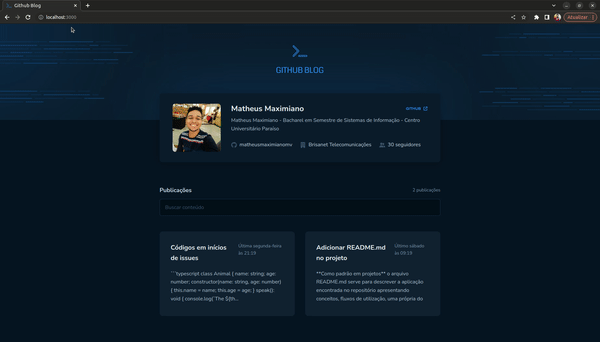

<h1 align="center">Trilha React Desafio 3 - Github Blog</h1>

  
  

  O terceiro desafio da trilha ReactJs do curso Ignite, consiste em uma aplicação para exibir o perfil do usuário, listar e filtrar as issues de um repositório do GitHub. Foram utilizadas bibliotecas como Axios, React Router Dom, react-hook-form e Zod, além dos hooks nativos do React, para facilitar a comunicação com a API do GitHub, implementar o roteamento da aplicação, criar um formulário de busca e garantir a performance otimizada.

A aplicação integra diversas bibliotecas e recursos do ecossistema React, resultando em uma interface que exibe o perfil do usuário, lista e filtra as issues, e exibe detalhes completos de uma issue selecionada. O uso do Axios simplifica as requisições HTTP, enquanto o React Router Dom permite uma navegação fluida entre as páginas. O react-hook-form e o Zod facilitam a criação e validação do formulário, e os hooks nativos do React otimizam a performance da aplicação.

## Apresentação

<h4 align="center">Tela inicial</h4>

  

 
<h4 align="center">Detalhes de Post</h4>

  

## Executando o Projeto
Para executar o projeto você precisa ter instalado o NPM ou o Yarn em sua máquina, em seguida, abra o terminal e execute os seguintes comandos:
1. Clone o projeto: `git clone https://github.com/matheusmaximianomv/desafio03-github-blog`
2. Instale as dependências:
 Usando NPM `npm install`
 Usando o Yarn `yarn`, caso tenha instalado.
3. Execute o projeto:
 Usando NPM `npm run dev`
 Usando o Yarn `yarn dev`, caso tenha instalado.
4. O App estará executando em http://localhost:3000
